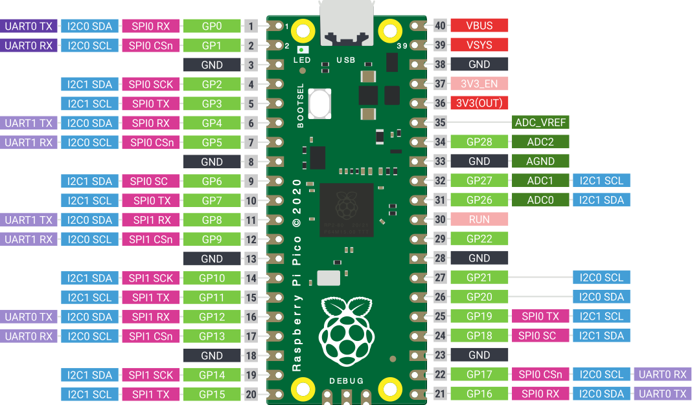

# DMX Tests with MicroControllers

Experiments related to these DMX512 projects:

* [DMX512 Java Library](https://github.com/codewriterbv/DMX512/)
* [DMX512 JavaFX user interface using the library](https://github.com/codewriterbv/DMX512-Demo)

**This repository contains several tests, all in "unstable situation" at this moment.**
 
* Arduino
  * Inspired by:
    * [Code Arduino DMX Receiver](https://learn.adafruit.com/intro-to-dmx/code-arduino-dmx-receiver)
* Raspberry Pi Pico
  * Inspired by:
    * [Raspberry Pi Pico W DMX Controller and DMX Quick Start for Beginners](https://www.instructables.com/Raspberry-Pi-Pico-W-DMX-Controller-and-DMX-Quick-S/)
    * [Source code on GitHub](https://github.com/john4242/artnet-pico-gateway)
* RS485 interface:
    * Amazon: [DollaTek RS485 Converter Module Arduino](https://www.amazon.com.be/-/en/DollaTek-RS485-Converter-Module-Arduino/dp/B099DRKBGQ/ref=sr_1_10)

## Pico Wiring 

### DollaTek TTL to RS485

- VCC → 3.3V (or 5V if your module requires it)
- GND → GND
- RXD → GP4 (Pico TX)
- TXD → GP5 (Pico RX)
- A/B terminals → Your RS485 network

### ILI9341 TFT Module

- VCC → 3.3V
- GND → GND
- CS → GP17
- RESET → GP20
- DC → GP16
- SDI(MOSI) → GP19
- SCK → GP18
- LED → 3.3V (backlight)

## Code Examples

### MicroPython on Pico

#### Prepare Pico for MicroPython

* Download the correct MicroPython UF2 file for your board from the [Raspberry Pi website](https://www.raspberrypi.com/documentation/microcontrollers/micropython.html).
* Restart the Pico while pressing "BOOTSEL".
* Drop the downloaded UF2 file on the Pico device that appears on your computer.

#### Programm the Pico

* [Download](https://thonny.org/) and open Thonny IDE.
* Select the "RP2024" in the lower right corner.
* Copy `main.py` to the Pico with Thonny.

### Raspberry Pi C

